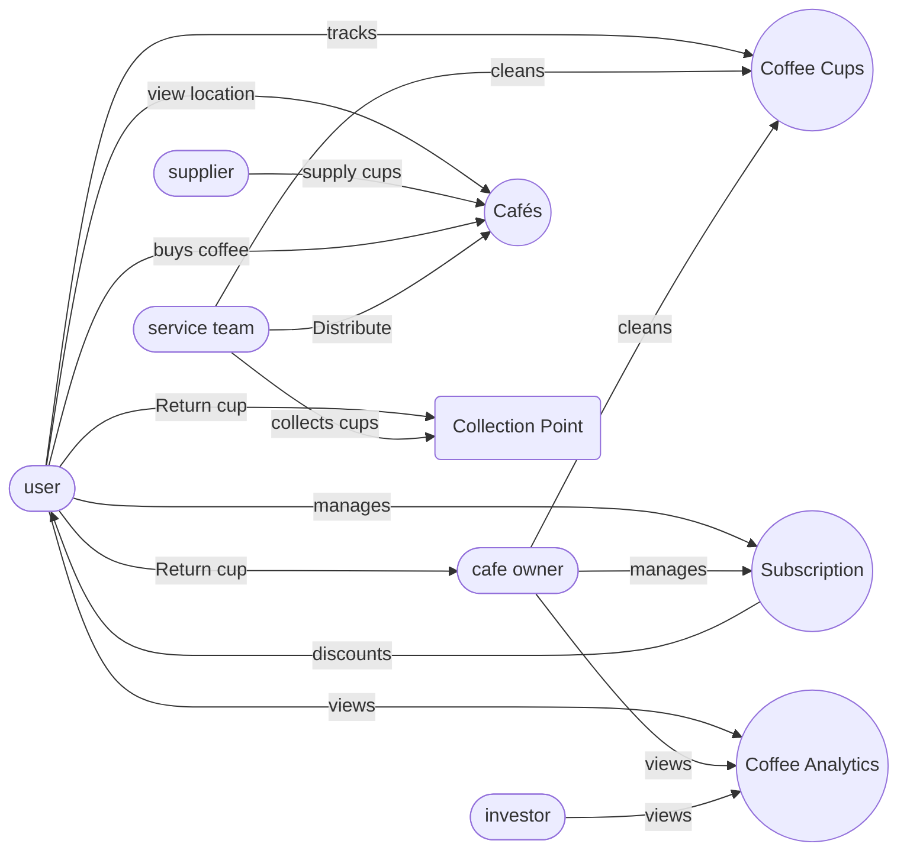
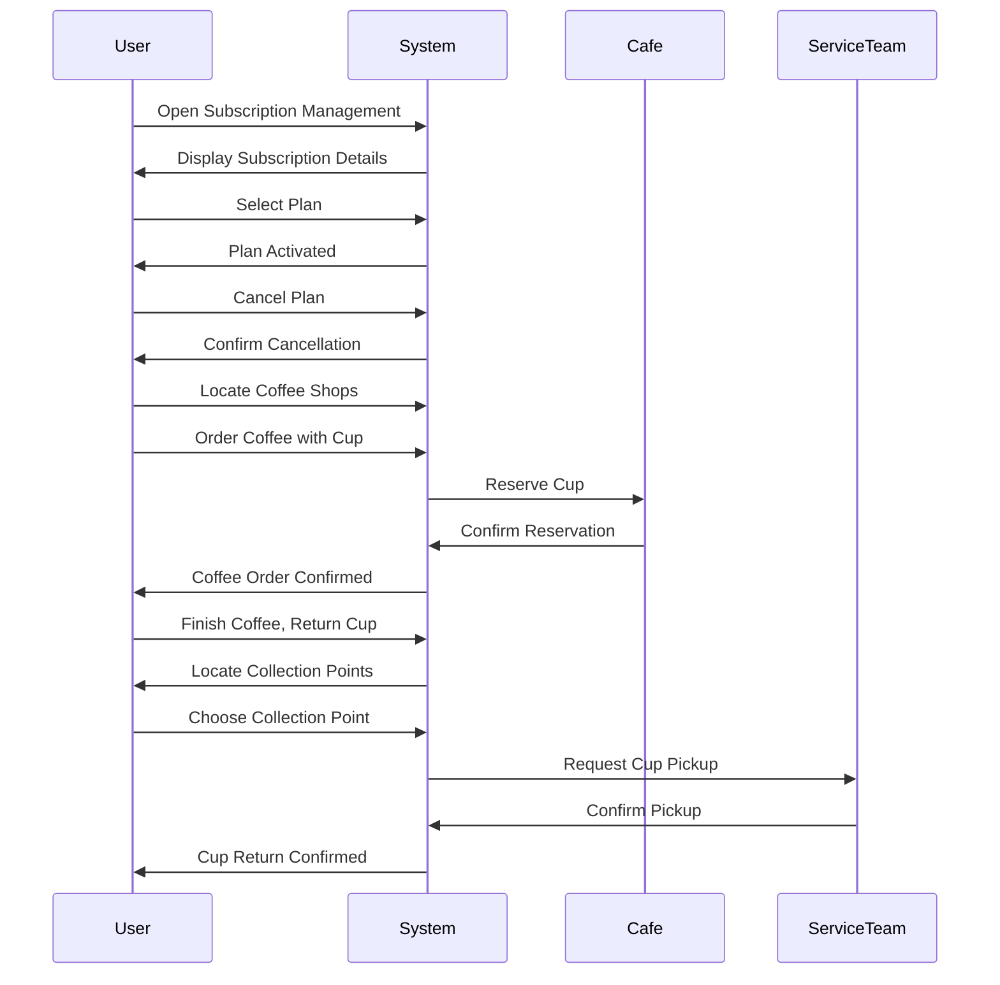

# **CupCycle**

## Our Vision
Our goal is to transform the coffee culture by promoting a more sustainable and easy approach to coffee consumption. We hope that our innovative solution will encourage widespread adoption of reusable coffee cups while minimizing single-use waste. Our platform will enable coffee fans to enjoy their favorite brews without the inconvenience of transporting or cleaning their cups by seamlessly integrating modern technology.

We imagine a future in which coffee enthusiasts can subscribe to our service, which will provide them with access to high-quality, trackable coffee cups at any participating coffee shop. Our technology will offer a smooth and trouble-free experience, allowing consumers to enjoy their coffee breaks at their own leisure, whether they are shopping, traveling, or studying.

We foresee a future where sustainability meets convenience, and every coffee cup contributes to the preservation of global resources, in collaboration with our stakeholders. Our primary objective is to lead the charge for a greener, more sustainable coffee culture for future generations. 

***

## The Team
- Ashton Lane (Ashton3211)

- Truong Nguyen (duckvd)

- Shadi Simon (ShadiSimon)

- Tristan Norbury (Tristan296)

### Change Log

| **Date** | **Version** | **What** |**Who**| **Peer Agreement** |
|:--|:--|:--|:--|:--|
| Aug 8 | 0.1 | Title, names of members, Logo | Tristan | 4/4 |
| Aug 14 | 0.2 | Vision Statement, Change log, Name (fix) |Tristan, Truong, Shadi | 3/4 |
| Aug 28 | 0.3 | Appendix creation, Work on other titles, About, Product, …| All | 4/4 |
| Aug 29 | 0.4 | Software Requirements, Product Perspective, added constraint | Tristan | 4/4 |
| Aug 30 | 0.5 | Use Case Diagram, 3 most important use cases, interaction diagram | Tristan | 4/4 |
| Sep 4 | 0.6 | Finish the outline + Software Desc. | Tristan, Ashton, Truong | 4/4 | 
| Sep 7 | 0.7 | Make scope + edit Elicitation methods | Ashton, Tristan, Simon | 4/4 |
| Sep 7 | 0.8 | Fill in point 6, 7, 8 and 9 | Ashton | 4/4 |

### About:

#### Purpose of SRS:
This document serves as a blueprint for the visionary reusable coffee cup initiative. By delineating the technical aspects, functionalities, and performance parameters, the SRS ensures alignment between the visionary aspirations and the practical implementation. It outlines how the innovative solution will be designed, developed, and integrated into a seamless software solution that functions on many platforms. The SRS facilitates the creation of a subscription-based model where coffee enthusiasts can effortlessly access and utilize high-quality, trackable coffee cups across various participating coffee shops. It defines the seamless integration of modern technology to simplify user experiences and guarantees convenience whether users are shopping, traveling, or studying. 

Ultimately, the SRS serves as a critical bridge between the visionary coffee culture transformation and the tangible software product that will drive its realization for the benefit of current and future generations.

#### Scope of the Reusable Coffee Cup Initiative Software

Our software scope has a wide range of features to ensure a seamless and tailored experience for our app users. Operating on a subscription-based model, our app caters to varying user needs, primarily targeting people who consistently buy coffee from cafes. The main focus is to develop a user-friendly app that allows smooth and problem-free interactions with our platform (reusable cup). 

A main feature of our app is its advanced cup tracking functionality, which benefits both coffee shops and users by allowing both to keep track of the coffee cups they have in rotation. Our app will interact with coffee shops in addition to the users, which will allow the shops to know the effect of them using our app on their business and the effect on the environment.  A core aspect of our scope is environmental sustainability, and we plan to provide users with metrics to measure their environmental footprint. Furthermore, our communication channels will be robust, offering customer support and assistance whenever needed.

### 1. Subscription-based Model:
A subscription-based model is a business model in which customers pay a recurring fee at a series of intervals such as monthly or annually to get a product or service. instead of making a one-time purchase, customers enter into an ongoing subscription agreement with the provider.
Recurring payments: Customers make periodic payments to maintain access to the product or service.
Flexibility: Subscriptions can often be customized to meet the specific needs of individual customers.  
Customer Retention: Subscription models focus on long-term customer relationships.

### 2. User-Friendly Mobile App:
A User-Friendly Mobile App is an application designed and developed with a focus on providing a smooth and intuitive experience for its users.
Intuitive Interface: The app's user interface(UI) is designed to be straightforward and self-explanatory.
Clear Navigation: The app has a well-organized navigation structure, with easily accessible menus, buttons, and links. 
Consistency: Design elements, such as buttons, icons colors, etc.

### 3. Cup Tracking and Management:
Cup tracking and management refers to the use of technology and systems to monitor, control, and optimize various aspects related to coffee cups within a specific context, such as a coffee shop, office, or event. Here are some key aspects of a coffee cup and tracking management are given below:
.Tracking and managing the inventory of coffee cups, including monitoring stock levels, reorder points, and procurement process.
. Recording and analyzing data on the consumption of coffee cups, including the number of cups used daily or regular specific periods.

### 4. Coffee Shop Integration:
Coffee shop integration refers to the process of incorporating various technologies, systems, and strategies into the operation of a coffee shop to enhance efficiency, customer experience, and overall management. Here are some key areas are given below:
Integration with modern POS systems allows for efficient order processing, payment handling, and inventory management:
implementing mobile apps or platforms that enable customers to place orders and make payments using their smartphones.
integration with inventory management software helps monitor and control stock levels of coffee beans, syrups, pastries, and other supplies.

### 5. Order Placement and Payment:
Order Placement and Payment processes are fundamental components of any business that offers products or services to customers. Here are a few overviews:
 Order Placement:
 A customer visits the coffee shop's physical location, approaches the counter, and gives their orders to the barista or cashier(Person Ordering).
Many coffee shops offer mobile apps or online platforms that allow customers to place orders in advance using their smart devices. (Mobile Ordering)
 Order Payments:
customers pay for their orders using physical currency(coins and banknotes).
Credit and debit cards are widely accepted for payment.
 
### 6. Sustainability Metrics:
- Plastic lids not used count
- Amount of rubbish produced

### 7. Support and Communication
In this context, effective communication skills, empathy, active listening, and a willingness to provide support are critical components of successful interaction and relationships.
We have 24/7 customer support for any issues a user or a coffee shop has with our application.
If issues are our fault, a refund is given

### 8. Scalability and Compatibility:
Our application will be available on both iPhone and Android to allow all users to access it.

### 9. Security and Privacy:
Our app will have privacy rules in place as well as an authorization system that stops unwanted users from accessing accounts. This is mainly to prevent attempts to get people's card details. 

### Software Description

- Product perspective (How normal people uses it):
	- User walks to a participating cafe and orders a coffee, providing their name to the cashier. Assuming the customer has an inactive cup and it was dropped off at that particular cafe, they will make the coffee and the cup will automatically become active on their signed-in app when the user walks away with it. In the app the user can also order coffee from participating coffee shops, where they can select any coffee they want in a CupCycle and they’ll collect it.

- Product functions (Of the software):
- The app shows how many cups the customer currently is using (active cups) and there is a limit of 3 cups per user.
- The app notifies the user if they lose their cup and shows its location
- The app also shows where the nearest cup collection points are and the nearest cafe’s participating in the eco-friendly coffee cup subscription.
- Loyalty program - 1st coffee = 1% discount, 2nd = 2% discount, 3rd = 3% .... 30th = 30% discount (max discount).
- Cups are made out of a recyclable material and eco-friendly ink for customisable cups. 

- User characteristics (Intended users and their roles): 
	- Office Workers, any worker, students, that rely on coffee and also understand the importance of recycling and reusing.

- Constraints (Limitations and restrictions towards the development or software):
	- Since the battery needs to power a low-energy gps, the battery inside the cup’s lid will need to be replaced approximately once a year (the battery can be taken out of the lid by the service team).

- Assumptions and dependencies: people will return their cups, people will not damage cups.

## Software Requirements

### Functional Requirements

1. **Cup Tracking**:
   - The app must track the status of coffee cups as "active" or "inactive."
   - Coffee cups are equipped with low-energy GPS and RFID tags for tracking.
   - When a cup is collected, it becomes "active" and this status is reflected in the app.
   - When a cup is dropped off, it becomes "inactive," and this status is also updated in the app.
   - Users can use the "Find My Cup" feature to locate their lost cups.
   - Users can view the cafe where each of their inactive cups is located, along with its location.

2. **Store Location**:
   - The app should display a list of all coffee shops participating in the cup swap service.

3. **Collection Point Management**:
   - The app must show the locations of all collection points.
   - Users can drop off or pick up coffee cups at these collection points.

4. **Security**:
   - **User Input and Sanitization**:
     - All input fields in the app must undergo validation to prevent SQL injections.

   - **Dual-Factor Authentication**:
     - During the initial sign-in, users will receive a one-time code sent to their mobile number for authentication.

   - **User Roles**:
     - The app will have different user roles, including regular users and coffee shop owners.
     - Regular users can track their cups, view participating store locations, and monitor the number of cups in use.
     - Coffee shop owners can only see the location of inactive cups, ensuring user privacy.
     - Coffee shop owners can also access metrics on how many coffees users have consumed.

### Non-Functional Requirements

1. **Performance and Efficiency**:
   - **Low Latency**: The app should have minimal latency in responding to user actions.
   - **Resource Efficiency**: The app should aim to use minimal device resources to conserve battery power.

2. **User-Friendly Interface**:
   - **Minimalistic Design**: The app should feature a minimalistic interface with a limited number of elements and features on the screen.
   - **Home Page Information**: The home page should display essential information at a glance when the app is opened.
   - **Notifications**: Any alerts or important messages should be sent as notifications and shown on the home screen.
   - **User Warnings**: For instance, users should be alerted if they have too many active cups and cannot order coffee until they drop off a cup at a participating cafe.

3. **Location-Based Features**:
   - **Locate Nearby Cafes**: The app should provide information about the closest participating cafes and collection points based on the user's current location.
     

### Use Cases
- Use Case diagram 

- Description of the three most important use cases:

1. Track cup location
- Users have the ability to go into the app to track their reusable cup if they lose it anywhere since it has built in gps. Cafe owners can also track cups if a cup is ‘inactive’ to ensure it's not at a different cafe that also provides the subscription.
2. Coffee Analytics
- This use case is critical for a variety of stakeholders, such as users, café owners, and investors. They may use the "Coffee Analytics" feature to examine statistics on coffee consumption, trends, and performance. This use case may entail creating reports including information such as how many users are subscribed, coffees ordered daily on average by users in specific cafes - this will give the investors a good understanding on their return on investment, and finally cafe owners and investors can make decisions based on the analytics offered.
3. Manage Subscription
- This use case involves the management of the subscription. Users are able to manage their subscription, including subscribing, upgrading, downgrading, changing payment details, and canceling their subscriptions. Cafe owners are also able to subscribe to a user, but they cannot manage a current subscription.

- Interaction diagram for the most important use case.

### Discussion

### Elicitation Methods:
Interviews:
Discussed to our stakeholders regarding their application requirements.
- Outlook:
Our strategy is for economic sustainability by focusing on long-term growth, expanded market presence, and a commitment to reducing single-use plastic waste. This is supported by a strong dedication to providing high-quality coffee mugs and assuring consumer happiness.
### Appendix

- Log of interactions with stakeholders.
- Jenkin He, Guryash
Date: 28 AUg
Present: Truong, Tristan, Ashton, Shadi
Minute taker: Truong, 15 minutes
Agenda: Stakeholder’s requirement, their specific need from the app and their use for the app.
Discussion summary: 
Decisions: Record the decisions w.r.t to the product and system that were taken.
Actions: Record tasks that were assigned to people
Next meeting: 4 Sep

- Log of interactions with stakeholders.
- Jenkin He, Guryash, Segun
Date: 4 Sep
Present: Truong, Tristan, Ashton, Shadi
Minute taker: Truong, 15 minutes
Agenda: Stakeholder’s requirement, their specific need from the app and their use for the app.
Discussion summary: PDF file for the SRS Andamooka to be sent to their group by Friday.
Decisions: Record the decisions w.r.t to the product and system that were taken.
Actions: Record tasks that were assigned to people
Next meeting: Set a date for the next meeting.

- References.
- Third-party-resources

